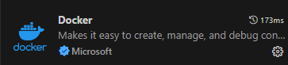
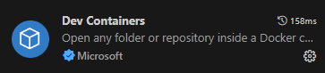
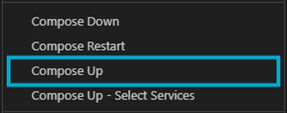
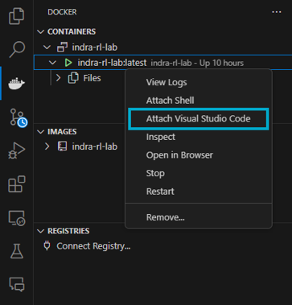
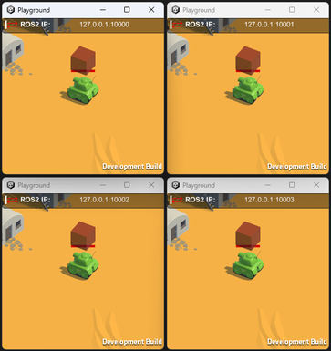

# Indra RL Lab

<p align="center">
  
</p>

[description]

<!-- ## Table of contents
- 🏠 [ABOUT](#about)
- ✨ [FEATURES](#features)
- 📋 [PREREQUISITES](#prerequisites)
- 📖 [GETTING STARTED](#getting-started)
- 🔧 [Installation](#installation)
- 🌍 [Environment](#environment)
- 🧠 [Training](#training)
- 🚀 [Deployment](#deployment)
- 📁 [PROJECT STRUCTURE](#project-structure) -->

## Table of contents
## Table of contents
<ul style="list-style: none; padding-left: 0;">
  <li>🏠 <a href="#about">ABOUT</a></li>
  <li>✨ <a href="#features">FEATURES</a></li>
  <li>📋 <a href="#prerequisites">PREREQUISITES</a></li>
  <li>📖 <a href="#getting-started">GETTING STARTED</a></li>
  <li style="margin-left: 20px;">🔧 <a href="#installation">Installation</a></li>
  <li style="margin-left: 20px;">🌍 <a href="#environment">Environment</a></li>
  <li style="margin-left: 20px;">🧠 <a href="#training">Training</a></li>
  <li style="margin-left: 20px;">🚀 <a href="#deployment">Deployment</a></li>
  <li>📁 <a href="#project-structure">PROJECT STRUCTURE</a></li>
</ul>


## ABOUT
[about]


## FEATURES
[features]


## PREREQUISITES

| Software                                        | Download link                                                      |
|-------------------------------------------------|--------------------------------------------------------------------|
| Docker Desktop                                  | [[download link]](https://www.docker.com/products/docker-desktop/) |
| Visual Studio Code                              | [[download link]](https://code.visualstudio.com/download)          |
| Windows X Server (for Docker GUI visualization) | [[download link]](https://github.com/marchaesen/vcxsrv/releases)   |


## GETTING STARTED

### Installation

**1.** Clone the repository

**2.** Open the repository in Visual Studio Code and start Docker Desktop

**3.** Install the [Docker](https://marketplace.visualstudio.com/items?itemName=ms-azuretools.vscode-docker) and [Dev Containers](https://marketplace.visualstudio.com/items?itemName=ms-vscode-remote.remote-containers) Visual Studio Code extensions

<p align="center">
  
  
</p>

**5.** Navigate to the [docker-compose.yml](docker-compose.yml) file, right-click and select `Compose Up` to start the container

<p align="center">
  
</p>

The first time the image is built this will take several minutes. Once the image has been built and the container is running, the output will show:

```output
 ✔ Network indra-rl-lab_default  Created
 ✔ Container indra-rl-lab        Started
```

***NOTE**: If your PC lacks a dedicated Nvidia graphics card, use the [docker-compose-no-gpu.yml](docker-compose-no-gpu.yml) file instead.


**6.** Attach a Visual Studio Code to the running container by right-clicking on the running container in the Docker extension tab, and selecting `Attach Visual Studio Code`

<p align="center">
  
</p>

A new instance of Visual Studio Code will open. Here you will have access to the container's files and python environment.

**7.** In the attached Visual Studio Code, open a new terminal and build the ROS workspace by running:

```bash
bash build.bash
```

```output
Starting >>> interfaces_pkg
Finished <<< interfaces_pkg [26.1s]                      

Summary: 1 package finished [27.1s]
Starting >>> rl_pkg  
Starting >>> ros_tcp_endpoint
Finished <<< ros_tcp_endpoint [5.57s]                                      
Finished <<< rl_pkg [5.94s]          

Summary: 2 packages finished [6.53s]
```

### Environment

In order to train or deploy a trained model in any of the use case environments, the environment simulation must be running. To launch it you must first select the use case and the number of parallel environments to run in the [config.yml](indra-rl-lab/volume/config.yml) file:

```yaml
environment:
  id: 'uc1'
  n_environments: 4
```

Then, open a new terminal ouside of the docker container, in the `Indra-RL-Lab\unity` directory and run:

On Windows:

```shell
launch_unity_simulation.bat
```

On Linux:

```bash
bash launch_unity_simulation.bash
```
The specified number of parallel environments will launch

<p align="center">
  
</p>

Finally, to connect the environment with the ROS2 network inside of the container, launch the ROS-TCP-Connector in the running container following command in a terminall attached to the container:

```bash
bash launch_ros_tcp_endpoint.bash
```

```
[INFO] [launch]: All log files can be found below /home/user/.ros/log/2024-10-08-19-23-43-347601-acc4bb0e6dfd-29296
[INFO] [launch]: Default logging verbosity is set to INFO
[INFO] [default_server_endpoint-1]: process started with pid [29323]
[INFO] [default_server_endpoint-2]: process started with pid [29325]
[INFO] [default_server_endpoint-3]: process started with pid [29327]
[INFO] [default_server_endpoint-4]: process started with pid [29329]
[default_server_endpoint-2] [INFO] [timestamp] [UnityEndpoint]: Starting server on 0.0.0.0:10001
[default_server_endpoint-4] [INFO] [timestamp] [UnityEndpoint]: Starting server on 0.0.0.0:10003
[default_server_endpoint-1] [INFO] [timestamp] [UnityEndpoint]: Starting server on 0.0.0.0:10000
[default_server_endpoint-3] [INFO] [timestamp] [UnityEndpoint]: Starting server on 0.0.0.0:10002
[default_server_endpoint-1] [INFO] [timestamp] [UnityEndpoint]: Connection from 172.19.0.1
[default_server_endpoint-3] [INFO] [timestamp] [UnityEndpoint]: Connection from 172.19.0.1
[default_server_endpoint-4] [INFO] [timestamp] [UnityEndpoint]: Connection from 172.19.0.1
[default_server_endpoint-2] [INFO] [timestamp] [UnityEndpoint]: Connection from 172.19.0.1
```

You can ignore any '`Publisher already registered for provided node name`' warning

You will notice that the red arrows of the build turn to blue:

<p align="center">
  
</p>


### Training

With the environment and the ROS-TCP-Connector running, you are now ready to launch your first training.

First, you must configure the training parameters in the [config.yml](indra-rl-lab/volume/config.yml) file:

```yaml
training:
  experiment_name: 'ppo'
  algorithm: 'PPO'

  pretrained_model:
    use_pretrained_model: true
    experiment_name: null
    checkpoint: null

  total_timesteps: 5000000

  logging:
    verbose: 2
    n_checkpoints: 30
    use_wandb: false
    wandb_entity: '[your-wandb-username/group]'
    
  evaluation:
    eval_freq: 10000
    eval_episodes: 32
```

Then, configure the algorithm config file corresponding to the algorithm selected. Here you can modify training parameters such as the learning rate or the neural network architecture. For instance, for PPO you must configure the [ppo_config.yml](/indra-rl-lab/volume/rl_pipeline/configs/ppo_config.yml) file:

```yaml
policy: 'MlpPolicy'
learning_rate: 0.0003
n_steps: 1024
batch_size: 8192
n_epochs: 50
gamma: 0.99
gae_lambda: 0.95
clip_range: 0.2
ent_coef: 0.0
vf_coef: 0.5
max_grad_norm: 0.5

policy_kwargs:
  activation_fn: 'ReLU'
  net_arch: 
    pi': [256, 256]
    vf': [256, 256]
  features_extractor_class: 'ResnetMLP'
  share_features_extractor: false
  features_extractor_kwargs:
    features_dim: 512
```

Finally, launch the training by running the following command in a terminal attached to the running container:

```bash
bash train.bash
```
```
Logging to experiments/uc1/ppo_[yy-mm-dd_hh-mm-ss]/tensorboard/PPO_1
---------------------------------
| rollout/           |          |
|    ep_len_mean     | 605      |
|    ep_rew_mean     | -22.4    |
| time/              |          |
|    fps             | 229      |
|    iterations      | 1        |
|    time_elapsed    | 71       |
|    total_timesteps | 16384    |
---------------------------------
...
```

The agent will start performing actions in the environment and a new directory will be created in the [experiments](indra-rl-lab/volume/experiments/) to store the model checkpoints, the training configuration, and additional training information.

#### Weights & Biases

Experiments can be logged to and stored in [Weights & Biases](https://wandb.ai/site). You must first create a W&B account and log in from the running container by running `wandb login` and pasting your wandb API key. Then, configure the [config.yml](indra-rl-lab/volume/config.yml) file to log to wandb by setting the `use_wandb` flag to true and setting your wandb username/group:

```yaml
logging:
  use_wandb: true
  wandb_entity: '[your-wandb-username/group]'
```

### Deployment

Once a model has been trained, you can deploy it into a running environment or parallel environments. First, specify the experiment and the checkpoint you want to deploy in the [config.yml](indra-rl-lab/volume/config.yml) file.

```yaml
deployment:
  experiment_name: 'ppo_[yy-mm-dd_hh-mm-ss]'
  checkpoint: 'best_model'
```

Then, with the environment and the ROS-TCP-Connector running, run the following command in a terminal inside the running container:

```bash
bash deploy.bash
```

## PROJECT STRUCTURE

[project structure]

