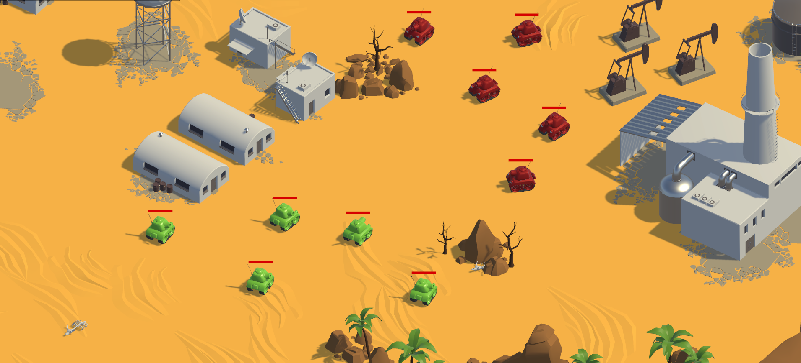

# Indra RL Lab



[description]

## Table of contents
- [🏠 About](#about)
- [✨ Features](#features)
- [📋 Prerequisites](#prerequisites)
- [📖 Getting Started](#getting-started)
    - [🔧 Installation](#installation)
    - [🚀 Deployment](#deployment)
- [📁 Project structure](#project-structure)

## About
[about]


## Features
[features]


## PREREQUISITES

| Software                                        | Download link                                                      |
|-------------------------------------------------|--------------------------------------------------------------------|
| Docker Desktop                                  | [[download link]](https://www.docker.com/products/docker-desktop/) |
| Visual Studio Code                              | [[download link]](https://code.visualstudio.com/download)          |
| Windows X Server (for Docker GUI visualization) | [[download link]](https://github.com/marchaesen/vcxsrv/releases)   |


## GETTING STARTED

### Installation

**1.** Clone the repository

**2.** Open the repository in Visual Studio Code and start Docker Desktop

**3.** Install the [Docker](https://marketplace.visualstudio.com/items?itemName=ms-azuretools.vscode-docker) and [Dev Containers](https://marketplace.visualstudio.com/items?itemName=ms-vscode-remote.remote-containers) Visual Studio Code extensions


**5.** Navigate to the [docker-compose.yml](docker-compose.yml) file, right-click and select `Compose Up` to start the container


The first time the image is built this will take several minutes. Once the image has been built and the container is running, the output will show:

```output
 ✔ Network indra-rl-lab_default  Created
 ✔ Container indra-rl-lab        Started
```

***NOTE**: If your PC lacks a dedicated Nvidia graphics card, use the [docker-compose-no-gpu.yml](docker-compose-no-gpu.yml) file instead.


**6.** Attach a Visual Studio Code to the running container by right-clicking on the running container in the Docker extension tab, and selecting `Attach Visual Studio Code`


A new instance of Visual Studio Code will open. Here you will have access to the container's files and python environment.

**7.** In the attached Visual Studio Code, open a new terminal and build the ROS workspace by running:

```bash
bash build.bash
```

```output
Starting >>> interfaces_pkg
Finished <<< interfaces_pkg [26.1s]                      

Summary: 1 package finished [27.1s]
Starting >>> rl_pkg  
Starting >>> ros_tcp_endpoint
Finished <<< ros_tcp_endpoint [5.57s]                                      
Finished <<< rl_pkg [5.94s]          

Summary: 2 packages finished [6.53s]
```

### Environment

In order to train or deploy a trained model in any of the use case environments, the environment simulation must be running. To launch it you must first select the use case and the number of parallel environments to run in the [config.yml](indra-rl-lab/volume/config.yml) file:

```yaml
environment:
  id: 'uc1'
  n_environments: 4
```

Then, open a new terminal ouside of the docker container, in the `Indra-RL-Lab\unity` directory and run:

On Windows:

```shell
launch_unity_simulation.bat
```

On Linux:

```bash
bash launch_unity_simulation.bash
```
The specified number of parallel environments will launch


Finally, to connect the environment with the ROS2 network inside of the container, run the following command in a terminal attached to the container:

```bash
bash launch_ros_tcp_endpoint.bash
```

```
[INFO] [launch]: All log files can be found below /home/user/.ros/log/2024-10-08-19-23-43-347601-acc4bb0e6dfd-29296
[INFO] [launch]: Default logging verbosity is set to INFO
[INFO] [default_server_endpoint-1]: process started with pid [29323]
[INFO] [default_server_endpoint-2]: process started with pid [29325]
[INFO] [default_server_endpoint-3]: process started with pid [29327]
[INFO] [default_server_endpoint-4]: process started with pid [29329]
[default_server_endpoint-2] [INFO] [1728415425.007956645] [UnityEndpoint]: Starting server on 0.0.0.0:10001
[default_server_endpoint-4] [INFO] [1728415425.008326815] [UnityEndpoint]: Starting server on 0.0.0.0:10003
[default_server_endpoint-1] [INFO] [1728415425.013931120] [UnityEndpoint]: Starting server on 0.0.0.0:10000
[default_server_endpoint-3] [INFO] [1728415425.046927438] [UnityEndpoint]: Starting server on 0.0.0.0:10002
[default_server_endpoint-1] [INFO] [1728415476.442710113] [UnityEndpoint]: Connection from 172.19.0.1
[default_server_endpoint-3] [INFO] [1728415476.442741181] [UnityEndpoint]: Connection from 172.19.0.1
[default_server_endpoint-4] [INFO] [1728415476.442758364] [UnityEndpoint]: Connection from 172.19.0.1
[default_server_endpoint-2] [INFO] [1728415476.443315738] [UnityEndpoint]: Connection from 172.19.0.1
```

You can ignore any '`Publisher already registered for provided node name`' warning

### Training

### Deployment


## PROJECT STRUCTURE

[project structure]

