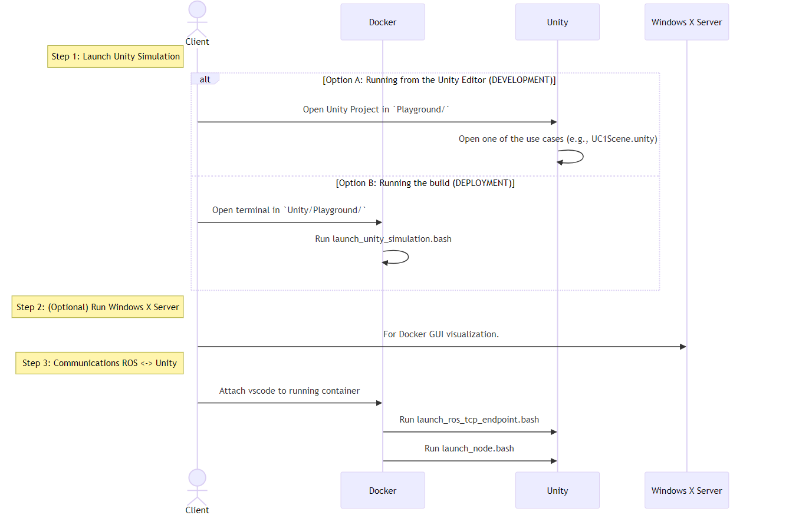
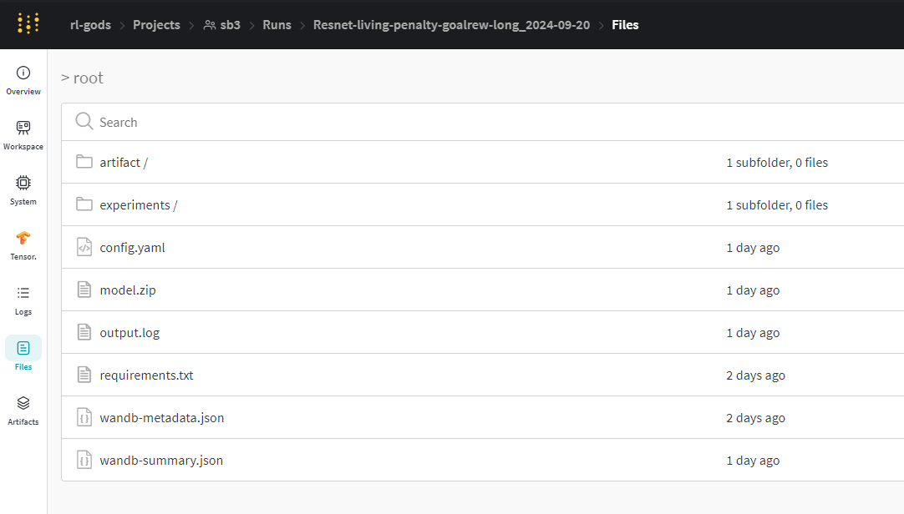

Training
******************

To set up an experiment, modify one of the YAML configuration files in the ``configs/`` directory or create a new one. You can adjust hyperparameters, architecture, and specify a path to a trained model for preloading.

**Example configuration file**: ``configs/base_ppo_config.yaml``

.. code-block:: yaml

   experiment:
     name: 'BipedalWalker-Benchmark'
   
   environment:
     id: 'BipedalWalker-v3'
     env_config: 'None'
     render_mode: 'rgb_array'
     monitor: true
     video_wrapper: true
     video_trigger: 5000
     video_length: 500
   
   training:
     algorithm: 'ppo'
     pretrained_model: 'None'
     use_wandb: true
     algorithm_parameters:
       policy: 'MlpPolicy'
       learning_rate: 0.0003
       n_steps: 8192
       batch_size: 512
       n_epochs: 5
       gamma: 0.99
       gae_lambda: 0.95
       clip_range: 0.2
       ent_coef: 0.0
       vf_coef: 0.5
       max_grad_norm: 0.5

     architecture:
       net_arch: {'pi': [128, 128], 'vf': [128, 128]}
       features_extractor_class: 'ResnetMLP'
       features_extractor_kwargs:
         features_dim: 128
       activation_fn: 'ReLU'
       share_features_extractor: false

     training:
       eval:
         seed: 5
         num_episodes: 5
         num_evals: 15
       total_timesteps: 500000
       device: 'cuda'
       log_points: 10
       verbose: 2

   evaluation:
     num_episodes: 1

   play:
     experiment: 'experiment_date'
     pretrained_model: 'model'

Adding Custom Models
====================
To use a custom architecture, add your PyTorch model class to the ``rl_pipeline/models/feature_extractors`` directory. Your model should inherit from the base extractor class provided in ``rl_pipeline/models/feature_extractors/base_extractor``.

.. code-block:: python

   # rl_pipeline/models/custom_cnn.py
   import torch
   from rl_pipeline.models.feature_extractors.base_extractor import BaseFeaturesExtractor

   class CustomCNN(BaseFeaturesExtractor):
       def __init__(self, observation_space, features_dim=256):
           super(CustomCNN, self).__init__(observation_space, features_dim)
           # Define your custom layers here

       def forward(self, observations):
           # Implement forward pass
           return features

Also, in ``rl_pipeline/configs`` directory the configuration should be updated to say that we use our custom model.

.. code-block:: yaml

   architecture:
     features_extractor_class: 'CustomCNN'
     features_extractor_kwargs:
       features_dim: 256

Running Training
================

To run an experiment, follow the steps mentioned in the main `readme <README.rst>`_:

#. Define the simulation parameters in the ``config.yml`` file:

    (MISSING) NOT IN CURRENT config.yml:

   .. code-block:: yaml

      ros:
        package_name: "examples_pkg"
        node_name: "train"

   When running the environment as a Unity standalone build, other parameters such as the number of parallel environments, the time scale, pause, and headless mode flags can be modified:

   .. code-block:: yaml

      n_environments: 1

      ros:
        package_name: "examples_pkg"
        node_name: "train"

      unity:
        build_path: "build/Playground.exe"
        headless_mode: false
        pause: false
        sample_time: 0.0
        time_scale: 1.0

#. Launch the Unity simulation:

   .. code-block:: bash

      launch_unity_simulation.bat

#. In Visual Studio Code attached to the running container, open two new terminals and run the following commands:

   .. code-block:: bash

      bash launch_ros_tcp_endpoint.bash
      bash launch_node.bash

   The ``launch_node.bash`` file launches the package and node specified in the configuration.

Loading Models
==============

(MISSING) EXAMPLE:

In the ``config`` file, fill the ``play`` section with the name of the experiment and the model. Ensure the model and experiment folder follow the specified structure.

You can also download models from the Weights & Biases page under the ``/files`` section.

(MISSING) EXAMPLE:

Other Environments
^^^^^^^^^^^^^^^^^^^
You can also run experiments on other gymnasium environments by running the ``train_example.py`` script with your configuration:

(MISSING) WHERE SCRIPT???:

.. code-block:: bash

   python train_example.py --config configs/base_ppo_config.yaml

