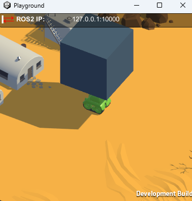

Use Case 1: Basic Navigation Example Environment
*************************************************

Introduction
============

Use Case 1 integrates with the Gym library to create a basic simulation environment for tank navigation. To get observations from the environment,
it uses a Lidar sensor whose rays can be seen in the following image:

|

.. note::
    The rays in red appear when we are touching an object, which happends when an object is at a distance equal or smaller than 10 m to the tank, otherwise they are green.

Objectives
==========

- Provide a fundamental environment for tank navigation using ROS and Gym.
- Enable integration with reinforcement learning algorithms by specifying observation, reward, and state management methods.
- Implement a training script that uses the Stable Baselines 3 library to train agents in the environment. It uses configuration files to try different algorithms, architectures, and hyperparameters.
- Develop a test script to validate the environment's functionality and behavior.

UC1Environment Class
====================

The class `UC1Environment` is defined, that inherits from `EnvironmentNode` and configures a Gym environment with specific parameters 
defining the observation, action spaces,and the reward range. These configurations are crucial for defining the
interaction between the agent and the environment, ensuring that both the agent's actions 
and the feedback it receives are appropriately scaled and represented.

Initialization
---------------

**__init__(self, environment_id: int)**: This constructor sets up the environment by initializing ROS parameters and Gym environment parameters.

  * **ROS Initialization**: Calls the parent class constructor (`EnvironmentNode.__init__`) to configure the ROS environment with specific message types and identifiers.

    .. code-block:: python

        EnvironmentNode.__init__(
            self,
            environment_name="uc1_environment",
            environment_id=environment_id,
            step_service_msg_type=UC1EnvironmentStep,
            reset_service_msg_type=UC1EnvironmentReset,
        )

  * **Gym Environment Initialization**:

    - **Observation Space**: Defines the observation space with a shape of 25 and a range from ``-1.0`` to ``1.0``.

      .. code-block:: python

          self.observation_space = gym.spaces.Box(
              low=-1.0,
              high=1.0,
              shape=(25,),
              dtype=np.float32
          )

    - **Action Space**: Defines the action space with a shape of 2, corresponding to the linear and angular velocity, and a range from ``-1.0`` to ``1.0``.

      .. code-block:: python

          self.action_space = gym.spaces.Box(
              low=-1.0,
              high=1.0,
              shape=(2,),
              dtype=np.float32
          )

    - **Reward Range**: Sets a reward range from ``-1.0`` to ``1.0``.

      .. code-block:: python

          self.reward_range = (-1.0, 1.0)

  * **Environment Parameters**: Sets parameters for velocity, yaw rate, and episode time limits:

        .. code-block:: python

          self._min_linear_velocity = -5.0
          self._max_linear_velocity = 5.0
          self._max_yaw_rate = 5.0
          self._max_episode_time_seconds = 60.0
          self._episode_start_time_seconds = None

    Variables for tracking the target distance are also initialized:

        .. code-block:: python

          self._current_target_distance = None
          self._previous_target_distance = None

Methods
--------

- **convert_action_to_request(self, action: np.ndarray = None)**: Converts the Gym action values into a ROS request format, scaling and mapping the action parameters to the ranges required by the ROS message fields.

  * **Action Scaling**: Converts action values from Gym to ROS format:

    - **Linear Velocity**: Scales `action[0]` from [-1.0, 1.0] to `[self._min_linear_velocity, self._max_linear_velocity]`.
    - **Yaw Rate**: Scales `action[1]` to `[0.0, self._max_yaw_rate]`.

    .. code-block:: python

        def convert_action_to_request(self, action: np.ndarray = None):
            # action = np.array([linear_velocity, yaw_rate])

            # Scale the action values
            linear_velocity = (action[0] + 1.0) * (self._max_linear_velocity - self._min_linear_velocity) / 2.0 + self._min_linear_velocity
            yaw_rate = action[1] * self._max_yaw_rate

            # Fill the step request
            self.step_request.action.tank.target_twist.y = linear_velocity
            self.step_request.action.tank.target_twist.theta = yaw_rate

            return self.step_request

- **convert_response_to_state(self, response)**: Converts the ROS response into a Gym-compatible state format by extracting the `state` from the ROS response.

    .. code-block:: python

        def convert_response_to_state(self, response):
            return response.state

- **reset(self)**: Resets the environment to its initial state and clears previous values related to target distance and health.

    .. code-block:: python

        self._episode_start_time_seconds = time.time()
        self._previous_target_distance = None
        

  And it is ensured that any additional reset procedures from the parent class are also executed.

    .. code-block:: python

        return super().reset()

- **observation(self, state) -> np.ndarray**: Provides the current observation based on the environment's state.

    * **Target Relative Position**: Computes the relative position of the target in the global coordinate system by subtracting the tank's position from the target's position. This position is then adjusted for the tank's yaw using a rotation transformation.

    .. code-block:: python

        target_relative_position = np.array([
            state.target_pose.x - state.tank.pose.x,
            state.target_pose.y - state.tank.pose.y,
            0.0
        ])

        yaw = state.tank.pose.theta
        r = Rotation.from_euler('z', yaw)
        target_relative_position = r.apply(target_relative_position)
        target_relative_position = target_relative_position[:2]

    * **Normalizing the target's relative position** based on the distance to ensure it falls within a specific range. If the distance is less than 1.0, the position is used as is; otherwise, it is scaled to be within the range [0, 1].

      .. code-block:: python

          self._current_target_distance = np.linalg.norm(target_relative_position)
          target_relative_position_normalized = target_relative_position if self._current_target_distance < 1.0 else target_relative_position / self._current_target_distance

    * **Linear and Angular Velocities**: Normalized to fit within a specified range.

      .. code-block:: python

          linear_velocity_normalized = (state.tank.twist.y - self._min_linear_velocity) / (self._max_linear_velocity - self._min_linear_velocity) * 2 - 1
          angular_velocity_normalized = state.tank.twist.theta / self._max_yaw_rate

    * **Lidar Data**: Normalizes the lidar data to fit within the range [0, 1] based on the minimum and maximum range values.

      .. code-block:: python

          ranges = np.array(state.tank.smart_laser_scan.ranges)
          lidar_ranges_normalized = (ranges - state.tank.smart_laser_scan.range_min) / (state.tank.smart_laser_scan.range_max - state.tank.smart_laser_scan.range_min)

    * **Health Information**: Normalized only for the agent's health.

      .. code-block:: python

          self._current_health_normalized = state.tank.health_info.health / state.tank.health_info.max_health

   .. important::

      **Combined Observation**: Concatenates all these normalized values into a single observation array that represents the state of the environment.
         
         .. code-block:: python

            observation = np.concatenate([
               target_relative_position_normalized,
               [linear_velocity_normalized],
               [angular_velocity_normalized],
               lidar_ranges_normalized,
               [self._current_health_normalized]
               
            ])

            return observation

- **reward(self, state, action: np.ndarray = None) -> float**. Computes the reward as a floating-point value for the agent based on the current state of the environment and actions taken. It is computed as follows:
    * **Initial Reward Setup**. The reward is initialized to the tank's current normalized health:

      .. code-block:: python

         reward = self._current_health_normalized

      This value ensures that the agent's health is factored into the reward calculation, encouraging actions that maintain or improve the tank's health.

    * **Distance-Based Reward**. If a previous target distance has been recorded (i.e., the agent has taken at least one step), it is computed the difference between the previous distance and the current distance to the target. The difference  is multiplied by a factor of `20.0` to increase the reward the agent gets for being closer to the target.

      .. code-block:: python

         if self._previous_target_distance is not None:
            reward += 20.0 * (self._previous_target_distance - self._current_target_distance)

    * **Update Previous Distance**. After calculating the reward, the current distance is stored as the previous distance for use in the next time step:

      .. code-block:: python

         self._previous_target_distance = self._current_target_distance

         return reward

- **terminated(self, state) -> bool**: Determines whether the current episode has ended based on the state of the environment.

    * Checks if the current timer count of a trigger sensor is bigger than its maximum allowed value.

      .. code-block:: python

         has_reached_target = state.target_trigger_sensor.timer_count > state.target_trigger_sensor.max_timer_count

    
    * Checks if the tank has died by evaluating if its health is less than or equal to 0.0.

        .. code-block:: python

            has_died = state.tank.health_info.health <= 0.0

    The episode is considered terminated if either the tank has died or it has reached the target.

    .. code-block:: python

        terminated = has_died or has_target_died

        return terminated

- **truncated(self, state) -> bool**: Checks if the episode has been truncated due to exceeding the maximum allowed time.

  To do so, the elapsed time since the episode started is calculated:

    .. code-block:: python

        episode_time_seconds = time.time() - self._episode_start_time_seconds

  And if the elapsed time exceeds the maximum limit, it is truncated:

    .. code-block:: python

        truncated = episode_time_seconds > self._max_episode_time_seconds

        return truncated

- **info(self, state) -> dict**: Provides additional information about the environment’s state.

    .. code-block:: python

        def info(self, state) -> dict:

            return {}

- **render(self, render_mode: str = 'human')**: Renders the current state of the environment based on the specified render mode.

   * **Render Mode Validation**. First it checks if the provided `render_mode` is valid. It supports two modes: `'human'` and `'rgb_array'`. If an invalid mode is specified, a `ValueError` is raised.

        .. code-block:: python

            valid_render_modes = ['human', 'rgb_array']

            if render_mode not in valid_render_modes:
                raise ValueError(f"Invalid render mode: {render_mode}. Valid render modes are {valid_render_modes}")

   * **State Extraction and Image Decompression**. Extracts the current state from `self.step_response` and decompresses the image data from the state.

        .. code-block:: python

            state = self.step_response.state

            # Decompress the image
            np_arr = np.frombuffer(state.compressed_image.data, np.uint8)
            image = cv2.imdecode(np_arr, cv2.IMREAD_COLOR)

   * **Rendering Based on Mode**:, which can be:
        - `'human'`: Displays the image in a window using OpenCV.
        - `'rgb_array'`: Returns the image as a NumPy array.

        .. code-block:: python

            if render_mode == 'human':
                cv2.imshow("ShootingExampleEnvironment", image)
                cv2.waitKey(1)

            elif render_mode == 'rgb_array':
                return image

Training Script for UC1 Environment
===================================

Function `train_uc1()` is responsible for training reinforcement learning agents within the **UC1Environment** using the **Stable Baselines 3** library. To do so, it sets up the training environment, loads configurations, and manages the training process using the `RLTrainer` class from the `rl_pipeline` module. 

#. Firstly, we load the **Configuration Files**: 
     - `config.yml`: Holds general environment settings.

        .. code-block:: yaml

            n_environments: 1
            use_case: uc1

            unity:
            build_name: "uc1/Playground"  # assume they are on builds/<machine>/<build_name>/<extension>, you dont need to set anything about the machine, just by running a .bash or .bat is enough
            headless_mode: false
            pause: false
            sample_time: 0.0
            time_scale: 1.0

     - `base_ppo_config.yaml`: Contains specific configurations for the Proximal Policy Optimization (PPO) algorithm. It can be changed in order to test various algorithms, architectures and hyperparameter values. Its id in the environment section must be specified, so we will name it `NavigationExample`` as we are in Use Case 1:
        
        .. code-block:: yaml

            id: 'NavigationExample'
            env_config: 'None'
            render_mode: 'rgb_array'
            monitor: true
            video_wrapper: false
            video_trigger: 5000
            video_length: 200

    So it results in the following lines:

        .. code-block:: python

            def train_uc1():
                # Load the configuration file
                config_file_path = "config.yml"
                train_config_path = 'rl_pipeline/configs/base_ppo_config.yaml'

    The files are loaded using `yaml.safe_load()` to ensure safe reading of YAML content.

        .. code-block:: python

            config = yaml.safe_load(open(config_file_path, 'r'))
            train_config = yaml.safe_load(open(train_config_path, 'r'))

#. **Experiment Name and Logging Directory**. The experiment name is dynamically created based on the current date, and a logging directory is structured to include the environment ID and algorithm name:

   .. code-block:: python

      exp_name = f"{train_config['experiment']['name']}_{str(datetime.date.today())}"
      log_dir = (Path('experiments/') / train_config['environment']['id'] / 
                 train_config['training']['algorithm'] / exp_name)

#. **Creating the Environment**. A vectorized environment, which allows the training of multiple agents in parallel, is created using the `UC1Environment.create_vectorized_environment()` method, where the number of environments (`n_environments`) is determined from the configuration file:

   .. code-block:: python

      n_environments = config["n_environments"]

      vec_env = UC1Environment.create_vectorized_environment(
          n_environments=n_environments, 
          return_type="stable-baselines", 
          monitor=train_config['environment']['monitor']
      )

#. **Video Recording** (Optional). If video recording is enabled in the configuration, the `VecVideoRecorder` is used to wrap the environment and record videos at every `video_trigger` step:

   .. code-block:: python

      if train_config['environment'].get('video_wrapper'):
          vec_env = VecVideoRecorder(
              vec_env,
              video_folder=f"{str(log_dir / 'videos')}",
              record_video_trigger=lambda x: x % train_config.get('environment').get('video_trigger') == 0,
              video_length=train_config.get('environment').get('video_length')
          )

#. **Resetting the Environment**. The `vec_env.reset()` call resets the vectorized environment to its initial state before training begins to ensure that all agents start from a clean state.

    .. code-block:: python

        vec_env.reset()

#. **Pre-trained Model Handling** (Optional). The path to a pre-trained model is obtained from the training configuration file to facilitate file operations, as long as the path is not set to `'None'`. 

    .. code-block:: python

        pm_path = train_config['training']['pretrained_model']
        pretrained_model = None if pm_path == 'None' else Path(pm_path)

#. **Trainer Initialization and Execution**:
   The `RLTrainer` class is instantiated using the given environment (`vec_env`), training configuration, 
   logging directory, optional pre-trained model, experiment name, and group information for tracking 
   experiments via WandB. 

    .. code-block:: python

      trainer = RLTrainer(env=vec_env, config=train_config['training'], log_dir=log_dir, pretrained_model=pretrained_model,
                          exp_name=exp_nlame, wandb_group=train_config['environment']['id'])

    Once initialized, the `run` method is called to start the training, with no external evaluation environment (which allows the model to be tested independently without influencing the ongoing training) or logger provided.

    .. code-block:: python

        trainer.run(eval_env=None, logger=None)

Test Script for UC1 Environment
===============================

This script tests `UC1Environment` called by function `test_uc1()` by using:
#. **test_gym_environment**: Tests a single environment.
#. **test_vectorized_environment**: Tests a vectorized environment with multiple instances.

test_uc1()
----------
This function is the entry point for testing both a single as well as a vectorized environment.

.. code-block:: python

    def test_uc1():
        # Run tests for both environments
        test_gym_environment()
        test_vectorized_environment()

test_gym_environment()
----------------------
This function tests a single instance of the `UC1Environment` by creating a gym environment, resetting it, taking actions, and rendering it continuously until the environment is terminated or truncated.

#. **Create the Environment**. The function begins by creating an instance of `UC1Environment` using the method `create_gym_environment`. In this case, `environment_id=0` as it is User Case 1.
   
   .. code-block:: python

        env = UC1Environment.create_gym_environment(environment_id=0)

#. A **Communication Monitor** is attached to the environment for debugging internal state information.
   
   .. code-block:: python

        communication_monitor = CommunicationMonitor(env)

#. **Reset the Environment**, bringing it to its initial state before testing.
   
   .. code-block:: python

        env.reset()

#. **Define Initial Action** by setting to an array of zeros corresponding to the linear and angular velocity: `[0.0, 0.0]`.

   .. code-block:: python

        action = np.array([0.0, 0.0])

#. **Main Loop**. An infinite loop (`while True`) is used to repeatedly take actions in the environment, observe the rewards, and render the environment until the episode is terminated or truncated.
    
   .. code-block:: python

        while True:
            observation, reward, terminated, truncated, info = env.step(action)

   In each iteration, the action is updated to `[1.0, 1.0]` to simulate a constant control signal, which directs the environment to take specific steps in both action dimensions. Alternatively, random actions can be generated using `np.random.uniform(-1.0, 1.0, 2)`.
   
   .. code-block:: python

        action = np.array([1.0, 1.0])
        # action = np.random.uniform(-1.0, 1.0, 2)

   After each action, the environment's state is rendered, allowing visual feedback of the simulation and if the environment reaches a terminal or truncated state, it is reset.

    .. code-block:: python

        env.render()

        if terminated or truncated:
            env.reset()

#. **Close the Environment** once the loop is manually stopped (e.g., by keyboard interrupt).
   
    .. code-block:: python

        env.close()

test_vectorized_environment()
-----------------------------
The `test_vectorized_environment` function is used to test a vectorized environment setup. This function initializes and interacts with multiple instances of the environment simultaneously. It loads configuration details from `config.yml` and uses a vectorized environment to execute actions across all instances.

#. **Loading the Configuration File config.yml** using the `yaml` library. This file holds general environment settings.

    .. code-block:: python

        config_file_path = "config.yml"
        config = yaml.safe_load(open(config_file_path))

#. **Creating the Vectorized Environment** using the `UC1Environment.create_vectorized_environment` method to obtain the specified number of environments running in parallel. 

    .. code-block:: python

        vec_env = UC1Environment.create_vectorized_environment(n_environments=n_environments, return_type='gym')

#. **Resetting the Environment** to initialize all environments to their starting states to interact with them.

    .. code-block:: python

        vec_env.reset()

#. **Defining Initial Actions** where each action (linear and angular velocity) is set to `[0.0, 0.0]`.

    .. code-block:: python

        actions = [[0.0, 0.0] for _ in range(vec_env.num_envs)]

#. **Interacting with the Environment** in a continuous loop, by calling `vec_env.step(actions)` method to perform actions in all environments. This method returns observations, rewards, termination flags, truncation flags, and additional information for each environment. After each step, new random actions are generated for the next iteration.

    .. code-block:: python

        while True:

            observations, rewards, terminateds, truncateds, infos = vec_env.step(actions)
            actions = [np.random.uniform(-1, 1, size=2) for _ in range(vec_env.num_envs)]

#. **Closing the Environment** after the loop (which runs indefinitely in this example) to free up resources. In practice, a condition would be needed to break out of the loop when testing is complete.

    .. code-block:: python

        vec_env.close()

Example
=======

With `launch_unity_simulation.bat` we start the simulation of multiple Unity instances with configurable parameters based on a YAML configuration file.

.. code-block:: bash

    launch_unity_simulation.bat

At this point we have no connection between ROS and Unity, so the arrows are red:

|

With `launch_ros_tcp_endpoint.bash` we enable the communications between ROS and Unity. 
It reads configuration details from a YAML file and launches multiple instances of a TCP endpoint node, each on a different port. 
This is useful for running several parallel environments of a server.

.. code-block:: bash

    bash launch_ros_tcp_endpoint.bash

So the arrows become blue in both directions to indicate the communication is established.

.. image:: ../_static/img/uc1/initial.png
            :alt: Communicating
            :align: center

|

Now, each time we are passing a message, the corresponding arrow indicating its direction will appear in yellow and we will see the tank moving through the environment:

